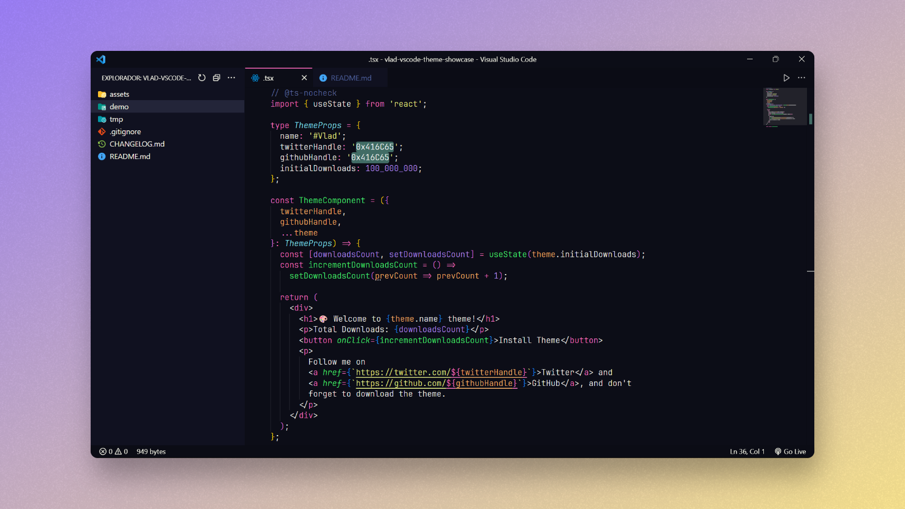

# #Vlad - A Dark Elegance

This represents a unique adaptation of Dracula's authentic theme, tweaked to exude a darker ambiance. I've further customized some JavaScript/TypeScript configurations and italic elements to suit my personal preferences.

## 🤝 Installation

1. Open the **Extensions** sidebar in VS Code
2. Search for `#Vlad`
3. Click **Install**
4. Open the **Command Palette** with `Ctrl+Shift+P` or `⇧⌘P`
5. Select **Preferences: Color Theme** and choose one of the #Vlad variants:
   - [`#Vlad (I)`](./assets/screenshot/theme-I.png)
   - [`#Vlad (II)`](./assets/screenshot/theme-II.png)
   - [`#Vlad (III)`](./assets/screenshot/theme-III.png)
6. Enjoy! 🎉 And maybe give a rating? ⭐

## 📣 Stay in touch

You can find me on the following social platforms:

- [Twitter](https://twitter.com/0x416C65)
- [GitHub](https://github.com/0x416C65)

Happy Coding! 🚀
